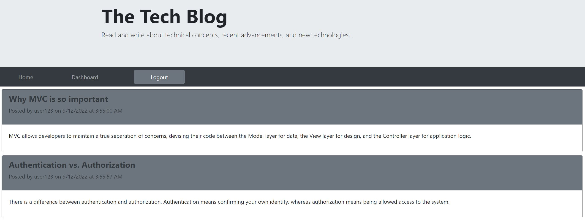
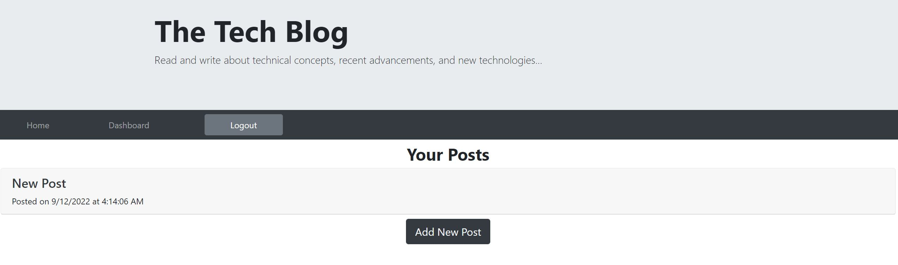
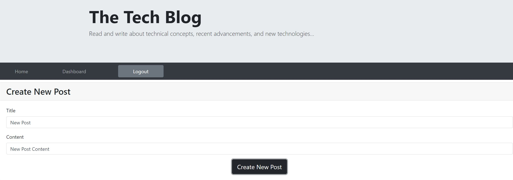
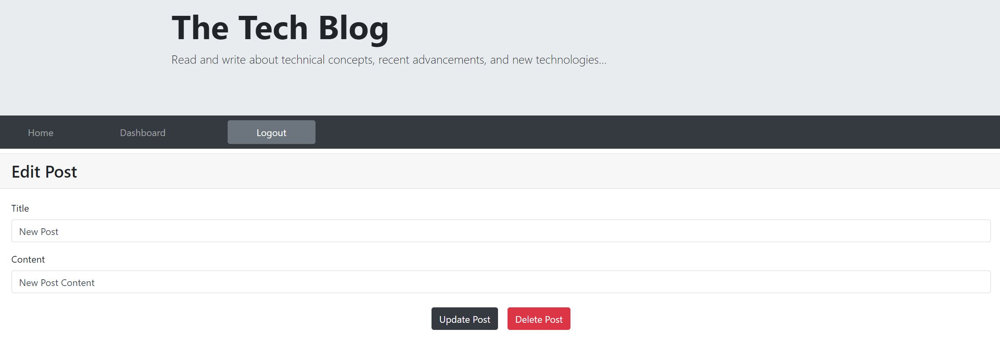
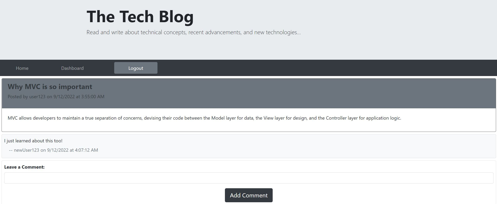

# mvc-tech-blog - 
CMS-style blog site where developers can publish their blog posts and comment on other developers’ posts

## **Description**
The `Tech Blog` allows users to publish their blog posts and comment on other developers’ posts regarding technical concepts, recent advancements, and new technologies.

## **Table of Contents**

- [Installation](#installation)
- [Usage](#usage)
- [License](#license)
- [Technology](#technology)
- [Questions](#questions)

## **Installation**

To install this application, make a `clone` of this repository to your local machine. Open the repository in your code editor of choice 🖥️ 

## **Usage**

Once the repository is cloned to your local machine, then:

Option 1 - Launch from the Terminal:
- Install the required packages by running `npm i` in your applicable terminal
- Update the `.env` file with your `MySQL username` and `MySQL password`
- Run the `schema.sql` in mysql to create and populate existing tables.
- Run `node seeds/index.js` to seed the database with test data.
- Run `node server.js` in your applicable terminal
- `Now listening` will appear in your termina
- Open `http://localhost:3001` in your web browser to see the generated HTML file

Option2 - Launch from a Web Browser:
- Visit the Tech Blog Website at [https://mvc-tech-blog-cc.herokuapp.com/](https://mvc-tech-blog-cc.herokuapp.com/)

Tech Blog Home Page:

Tech Blog Dashboard Page:

Tech Blog Create Post Page:

Tech Blog Update Post Page:

Tech Blog Add Comment Page:

Walkthrough of Tech Blog Functionality:
Part 1:

https://user-images.githubusercontent.com/103088786/189594610-b50c1bfb-9d47-453d-9a80-9aa35a2d232f.mp4

Part 2:

https://user-images.githubusercontent.com/103088786/189594641-0ea74e6d-9ccb-4c69-9918-e015775b2e6b.mp4

## **License**

MIT License

Copyright &copy; 2022 Cheryl Caitano

Permission is hereby granted, free of charge, to any person obtaining a copy
of this software and associated documentation files (the "Software"), to deal
in the Software without restriction, including without limitation the rights
to use, copy, modify, merge, publish, distribute, sublicense, and/or sell
copies of the Software, and to permit persons to whom the Software is
furnished to do so, subject to the following conditions:

The above copyright notice and this permission notice shall be included in all
copies or substantial portions of the Software.

THE SOFTWARE IS PROVIDED "AS IS", WITHOUT WARRANTY OF ANY KIND, EXPRESS OR
IMPLIED, INCLUDING BUT NOT LIMITED TO THE WARRANTIES OF MERCHANTABILITY,
FITNESS FOR A PARTICULAR PURPOSE AND NONINFRINGEMENT. IN NO EVENT SHALL THE
AUTHORS OR COPYRIGHT HOLDERS BE LIABLE FOR ANY CLAIM, DAMAGES OR OTHER
LIABILITY, WHETHER IN AN ACTION OF CONTRACT, TORT OR OTHERWISE, ARISING FROM,
OUT OF OR IN CONNECTION WITH THE SOFTWARE OR THE USE OR OTHER DEALINGS IN THE
SOFTWARE.

## **Technology**

- [JavaScript](https://www.javascript.com/) Scripting Language
- [Node](https://nodejs.org/en/) JavaScript runtime
- [npm](https://www.npmjs.com/) Inquirer, Express, UUID, etc.
- [Heroku](https://devcenter.heroku.com/) Cloud Application Platform
- [Express]() Express.js
- [MySQL](https://dev.mysql.com/doc/) MySQL Database
- [Sequelize](https://www.npmjs.com/package/sequelize) Sequelize
- [Handlebars](https://handlebarsjs.com/) Templating

## **Questions**

For any questions or contributions please contact me on Github or by e-mail:

[Github Profile](https://www.github.com/ccaitano)  
[Email Me](mailto:cheryl.caitano@gmail.com)
